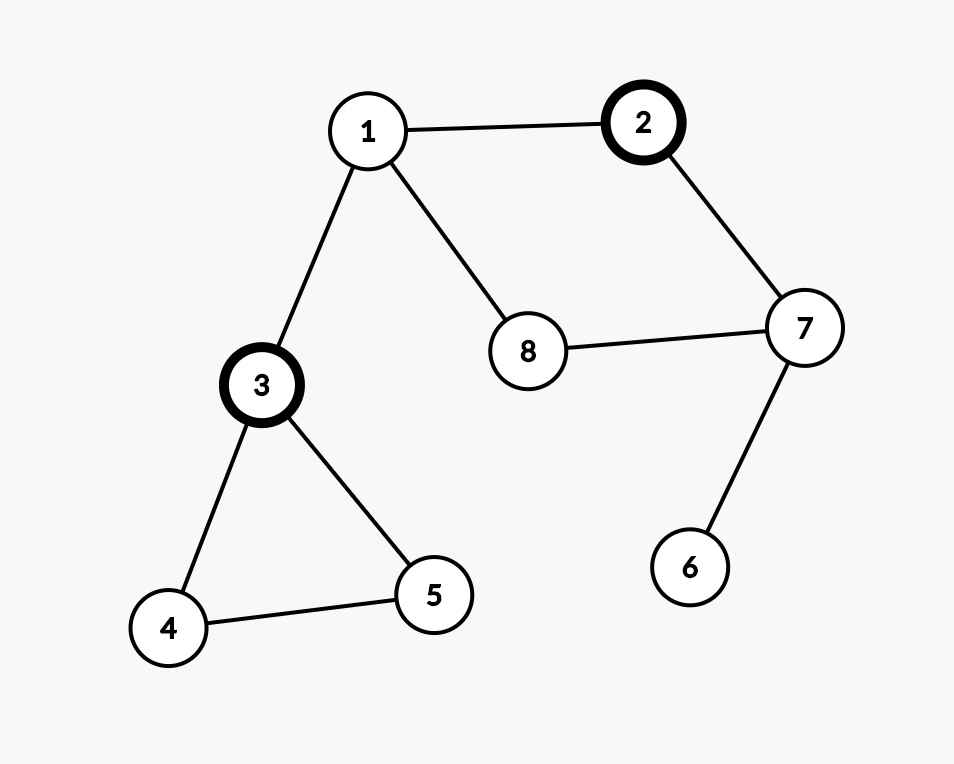

# DFS/BFS
>  그래프를 탐색하기 위한 대표적인 두 가지 알고리즘

## 탐색(search)란
> 많은 양의 데이터 중에서 원하는 데이터를 찾는 과정을 의미  
> 대표적인 탐색 알고리즘으로는 DFS/BFS가 있음  
> DFS/BFS를 이해하기 위해선 기본 자료구조인 스택과 큐에 대한 이해가 필요  

## 자료구조(Data Structure)란
> 데이터를 표현하고 관리하고 처리하기 위한 구조
> 그 중 스택과 큐는 자료구조의 기초개념으로 다음 두 핵심적인 함수로 구성
- 삽입(PUSH) : 데이터를 삽입
- 삭제(POP) : 데이터를 삭제

## 스택(StacK)이란
> 스택은 박스 쌓기에 비유할 수 있음  
> 흔히 박스는 아래에서부터 위로 쌓고, 위에서 아래 순서로 내림  
> 이러한 구조를 선입후출(First In Last Out)구조 또는 후입선출(Last In First Out)구조라 함.

### 5-1.py 예제

<!-- <code> -->
    stack = []

    # 삽입(5) - 삽입(2) - 삽입(3) - 삽입(7) - 삭제() - 삽입(1) - 삽입(4) - 삭제()
    
    stack.append(5)
    stack.append(2)
    stack.append(3)
    stack.append(7)
    stack.pop()
    stack.append(1)
    stack.append(4)
    stack.pop()

    print(stack)
    print(stack[::-1])

    # [5,2,3,1]
    # [1,3,2,5]

> 파이썬에서 스택을 이용할 때는 별도의 라이브러리를 사용할 필요가 없음  
> 기본 리스트에서 append()와 pop() 메서드를 이용하면 스택 자료구조와 동일하게 동작  
> append() 메서드는 리스트의 가장 뒤쪽에 데이터를 삽입하고, pop() 메서드는 리스트의 가장 뒤쪽에서 데이터를 꺼냄

## 큐(Queue)란
> 큐란 대기 줄에 비유할 수 있음  
> 나중에 온 사람일수록 나중에 들어가기 때문에 '공정한' 자료구조라고 비유  
> 이러한 구조를 선입선출(Fist in Fist Out)구조라 함

### 5-2.py 큐 예제

    from collections import deque

    queue = deque()

    # 삽입(5) - 삽입(2) - 삽입(3) - 삽입(7) - 삭제() - 삽입(1) - 삽입(4) - 삭제()  
    queue.append(5)
    queue.append(2)
    queue.append(3)
    queue.append(7)
    queue.popleft()
    queue.append(1)
    queue.append(4)
    queue.popleft()

    print(queue)
    queue.reverse()
    print(queue)

    # deque([3,7,1,4])
    # deque([4,1,7,3])

> 파이썬으로 큐를 구현할 때는 collections 모듈에서 제공하는 deque 자료구조를 활용하면 됨  
> deque는 스택과 큐의 장점을 모두 채택한 것으로 데이터 입출력 속도가 리스트에 비해 효율적이며 queue 라이브러리를 이용하는 것보다 간단함
> 코딩 테스트에서 collections 모듈과 같은 기본 라이브러리 사용을 허용하므로 안심하고 사용가능

## 재귀함수(Recursive Function)
> 재귀함수란 자기자신을 다시 호출하는 함수를 의미

### 5-3.py 재귀함수 예제

    def recursive_function():
        print("재귀함수를 호출합니다)
        recursive_function()
    
    recursive_function()

> 어느정도 출력하고 나면 다음과 같은 오류메시지를 출력하고 멈춤

- RecursionError: maximum recursion depth exceeded while pickling an object
> 이 오류 메시지는 재귀의 최대 깊이를 초과했다는 내용  

### 재귀 함수의 종료조건
> 재귀함수는 언제 끝날지, 종료조건을 꼭 명시해야 함

### 5-4.py 재귀 함수 종료 예제
    def recursive_function(i):
        # 100번째 출력했을 때, 종료되도록 종료 조건 명시

        if i == 100:
            return

        print(i, '번째 재귀 함수에서', i+1,'번째 재귀 함수를 호출합니다.')
        recursive_functino(i+1)
        print(i, '번째 재귀 함수를 종료합니다.')

    recursive_function(1)

> 재귀 함수를 이용하는 대표적인 예제로는 팩토리얼(Factorial)문제가 있다  
> 수학적으로 0!와 1!의 값은 1로 같다는 성질을 이용하ㅣ여 팩토리얼 메서드는 n이 1이하가 되었을 때
함수를 종료하는 재귀함수의 형태로 구현할 수 있음

### 5-5.py 2가지 방식으로 구현한 팩토리얼 예제

    # 반복적으로 구현한 n!
    def factorial_iterative(n):
        result = 1
        # 1부터 n까지의 수를 차례대로 곱하기
        for i in range(1, n+1):
            result *= i
        return result

    def factorial_recursive(n):
        if n <= 1:
            return 1

        # n! = n * (n-1)!를 그대로 코드로 작성하기 
        return n * factorial_recursive(n-1)

    print("반복적으로 구현:", factorial_iterative(5))
    print("재귀적으로 구현:", factorial_recursive(5))

> 위 두 코드를 비교했을 때, 결과는 동일하지만 재귀함수가 훨씬 간결한 것을 알 수 있음  
> 이 개념은 이후, '다이나믹 프로그래밍'에서 이어지기 때문에 중요  

1. n이 0 혹은 1 일때 : factorial(n) = 1
2. n이 1보다 클 때 : factorial(n) = n * factorial(n-1)

> 일반적으로 점화식에서 종료 조건을 찾을 수 있는데, 팩토리얼은 n이 양의 정수일 때에만 유효하기 때문에 n이 1 이하인 경우 1을 반환할 수 있도록 재귀 함수를 작성해야한다.  
> 재귀 함수의 소스코드와 점화식이 매우 닮아있는 것을 확인할 수 있음.  
> 다시 말해 재귀 함수는 반복문을 이용하는 것과 비교했을 때, 더욱 간결한 형태임을 이해할 수 있음.  

# 탐색 알고리즘 DFS/BFS

## DFS

DFS(Depth-First Search)란  
깊이 우선 탐색이라고도 부르며, 그래프에서 깊은 부분을 우선적으로 탐색하는 알고리즘

> 그래프는 노드(Node)와 간선(Edge)으로 표현되며, 이때 노드를 정점(Vertex)이라 함.
> 그래프 탐색이란 하나의 노드를 시작으로 다수의 노드를 방문하는 것을 말함.
> 또한 두 노드가 간선으로 연결되어 있다면 '두 노드는 인접하다(Adjacent)'라고 표현 함

프로그래밍에서 그래프는 크게 2가지 방식으로 표현할 수 있음
- 인접행렬(Adjacency Matrix) : 2차원 배열로 그래프의 연결관계를 표현하는 방식
- 인접리스트(Adjacency List) : 리스트로 그래프의 연결 관계를 표현하는 방식

### 5-6.py 인접행렬 방식 예제

    INF = 999999 # 무한의 비용 선언

    # 2차원 리스트를 이용해 인접행렬 표현
    graph = [
        [0,7,5],
        [7,0,INF],
        [5,INF,0]
    ]

    print(graph)

인접리스트(Adjacency List)방식은 모든 노드에 연결된 노드에 대한 정보를 차례대로 연결하여 저장

### 5-7.py 인접 리스트 방식 예제

    # 행(Row)이 3개인 2차원 리스트로 인접 리스트 표현
    graph = [[] for _ in range(3)]

    # 노드 0에 연결된 노드 정보 저장(노드, 거리)
    graph[0].append((1,7))
    graph[0].append((2,5))

    # 노드1에 연결된 노드 정보 저장(노드, 거리)
    graph[1].append((0,7))

    # 노드2에 연결된 노드 정보 저장(노드, 거리)
    graph[2].append((0,5))

    print(graph)

> 메모리 측면에서 보자면 인접행렬 방식은 모든 관계를 저장하므로 노드 개수가 많을수록 낭비  
> 반면 인접리스트 방식은 연결된 정보만 저장하므로 메모리가 효율적  
  
> 인접리스트 방식은 인접행렬 방식에 비해 특정한 두 노드가 연결되어 있는지에 대한 정보를 얻는 속도가 느림  
> 인접 리스트 방식은 연결된 데이터를 하나씩 확인해야 함  
  
> 특정한 노드와 연결된 모든 인접 노드를 순회해야 하는 경우, 인접 리스트 방식이 인접행렬 방식에 비해 메모리 공간의 낭비가 적다.  

> DFS는 깊이 우선 탐색 알고리즘
> 특정한 경로를 탐색하다가 특정한 상황에서 최대한 깊숙이 들어가서 노드를 방문 후, 다시 돌아가 다른 경로를 탐색  

1. 탐색 시작 노드를 스택에 삽입하고 방문 처리
2. 스택의 최상단 노드에 방문하지 않은 인접 노드가 있으면 그 인접 노드를 스택에 넣고 방문처리
  방문하지 않은 인접노드가 없으면 스택에서 최상단 노드를 꺼냄
3. 2번의 과정을 더 이상 수행할 수 없을 때까지 반복

그래프 사이트 : https://csacademy.com/app/graph_editor/

STEP1. 시작 노드인 '1'을 스택에 삽입하고 방문처리  
STEP2. 스택의 최상단 노드인 '1'에 방문하지 않은 인접노드 '2','3','8' 중 가장 작은 노드 '2'를 스택에 넣고 방문처리  
STEP3. 스택의 최상단 노드인 '2'에 방문하지 않은 인접 노드 '7'을 스택에 넣고 방문처리  
STEP4. 스택의 최상단 노드인 '7'에 방문하지 않은 인접 노드 '6','8'중 가장 작은 노드 '6'을 스택에 넣고 방문처리  
STEP5. 스택의 최상단 노드인 '6'에 방문하지 않은 인접노드가 없어 스택에서 '6'번 노드를 꺼냄  
STEP6. 스택의 최상단 노드인 '7'에 방문하지 않은 인접노드 '8'을 스택에 넣고 방문처리  
STEP7. 스택의 최상단 노드인 '8'에 방문하지 않은 인접노드가 없어 스택에서 '8'번 노드를 꺼냄  
STEP8. 스택의 최상단 노드인 '7'에 방문하지 않은 인접노드가 없어 스택에서 '7'번 노드를 꺼냄  
STEP9. 스택의 최상단 노드인 '2'에 방문하지 않은 인접노드가 없어 스택에서 '2'번 노드를 꺼냄  
STEP10. 스택의 최상단 노드인 '1'에 방문하지 않은 인접노드 '3'을 스택에 넣고 방문처리  
STEP11. 스택의 최상단 노드인 '3'에 방문하지 않은 인접노드 '4'와'5' 중 '4'를 스택에 넣고 방문처리  
STEP12. 스택의 최상단 노드인 '4'에 방문하지 않은 인접노드 '5'를 스택에 넣고 방문처리  
STEP13. 남아있는 노드에 방문하지 않은 인접노드가 없다. 따라서 모든 노드를 차례대로 꺼내면 다음과 같다.  

1 -> 2 -> 7 -> 6 -> 8 -> 3 -> 4 -> 5

> 깊이 우선 탐색 알고리즘인 DFS는 스택 자료구조에 기초한다는 점에서 구현이 간단  
> 실제로 스택을 쓰지 않아도 되며 탐색을 수행함에 있어서 데이터 개수가 N개인 경우 O(N)의 시간이 소요  

### 5-8.py DFS예제

    # DFS 메서드 정의
    def dfs(graph, v, visited):
        # 현재 노드를 방문 처리
        visited[v] = True
        print(v, end=' ')
        # 현재 노드와 연결된 다른 노드를 재귀적으로 방문
        for i in graph[v]:
            if not visited[i]:
                dfs(graph, i, visited)

    # 각 노드가 연결된 정보를 리스트 자료형으로 표현(2차원 리스트)
    graph = [
        [],
        [2,3,8],
        [1,7],
        [1,4,5],
        [3,5],
        [3,4],
        [7],
        [2,6,8],
        [1,7]
    ]

    # 각 노드가 방문된 정보를 리스트 자료형으로 표현(1차원 리스트)
    visited = [False] * 9

    # 정의된 DFS함수 호출
    dfs(graph,1,visited)

## BFS

> BFS(Breath First Search)알고리즘은 '너비 우선 탐색'이라는 의미  
> DFS는 최대한 멀리 있는 노드를 우선으로 탐색하는 방식이고, BFS는 가까운 노드부터 탐색하는 알고리즘  
> BFS구현은 선입선출 방식인 큐 자료구조를 이용

1. 탐색 시작 노드를 큐에 삽입하고 방문처리
2. 큐에서 노드를 꺼내 해당 노드의 인접 노드 중에서 방문하지 않은 노드를 모두 큐에 삽입하고 방문처리
3. 2번 과정을 더 이상 수행할 수 없을 때까지 반복

그래프 사이트 : https://csacademy.com/app/graph_editor/

STEP1. 시작 노드인 '1'을 큐에 삽입하고 방문처리  
STEP2. 큐에서 노드 '1'을 꺼내고 방문하지 않은 인접노드 '2','3','8'을 모두 큐에 삽입하고 방문처리  
STEP3. 큐에서 노드 '2'를 꺼내고 방문하지 않은 인접노드 '7'을 큐에 삽입하고 방문처리  
STEP4. 큐에서 노드 '3'을 꺼내고 방문하지 않은 인접노드 '4'와 '5'를 모두 큐에 삽입하고 방문처리  
STEP5. 큐에서 노드 '8'을 꺼내고 방문하지 않은 인접노드가 없으므로 무시  
STEP6. 큐에서 노드 '7'을 꺼내고 방문하지 않은 인접 노드 '6'을 큐에 삽입하고 방문처리  
STEP7. 남아있는 노드에 방문하지 않은 인접노드가 없음  

1 -> 2 -> 3 -> 8 -> 7 -> 4 -> 5 -> 6

> 너비우선탐색 알고리즘인 BFS는 큐 자료구조에 기초한다는 점에서 구현이 간단  
> 실제 구현함에 있어 deque라이브러리를 사용하는 것이 좋으며 탐색을 수행함에 있어 O(N)의 시간이 소요
> 일반적인 경우 실제 수행시간은 DFS보다 좋은 편이라는 점까지만 추가로 기억  

> 재귀 함수로 DFS를 구현하면 컴퓨터 시스템의 동작 특성상 실제 프로그램의 수행 시간은 느려질 수 있음
> 따라서 스택 라이브러리를 이용해 시간복잡도를 완화하는 테크닉이 필요

### 5-9.py BFS 예제

    from collections import deque

    # BFS 메서드 정의
    def bfs(graph, start, visited):
        # 큐(queue) 구현을 위해 deque라이브러리 사용
        queue = deque([start])
        # 현재 노드를 방문 처리
        visited[start] = True
        # 큐가 빌 때까지 반복
        while queue:
            # 큐에서 하나의 원소를 뽑아 출력
            v = queue.popleft()
            print(v, end='')
            # 해당 원소와 연결된, 아직 방문하지 않은 원소들을 큐에 삽입
            for i in graph[v]:
                if not visitied[i]:
                    queue.append(i)
                    visited[i] = True

    # 각 노드가 연결된 정보를 리스트 자료형으로 표현(2차원 리스트)
    graph = [
        [],
        [2,3,8],
        [1,7],
        [1,4,5],
        [3,5],
        [3,4],
        [7],
        [2,6,8],
        [1,7]
    ]

    # 각 노드가 방문된 정보를 리스트 자료형으로 표현(1차원 리스트)
    visited = [False] * 9

    # 정의된 DFS함수 호출
    bfs(graph,1,visited)

| |DFS|BFS|
|---|---|---|
|동작 원리|스택|큐|
|구현 방법|재귀 함수 이용|큐 자료구조 이용|

